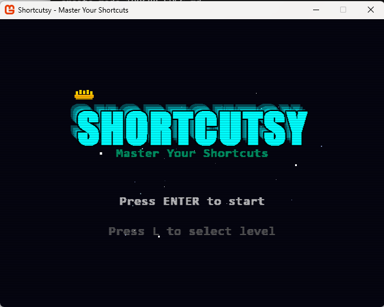
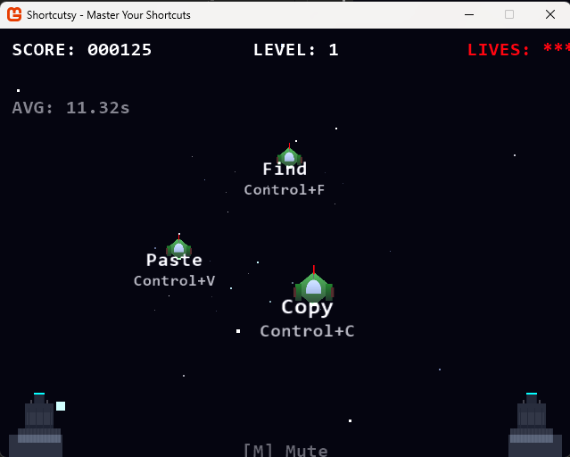

# Shortcutsy

**Play the web version:** https://eliaslopezgt.github.io/shortcutsy/



A retro 80s Missile Command-style game that helps players memorize Visual Studio keyboard shortcuts through gameplay.

## Overview

Shortcutsy is a educational game where spaceships descend toward the player, each displaying a Visual Studio keyboard shortcut. The player must press the correct key combination to destroy the spaceship before it reaches the player's position.

### Game Flow

1. **Start**: Press Enter on the title screen, or press L to select a level
2. **Level Select**: Choose which level to play (1-10) - each level shows its high score
3. **Gameplay**: Spaceships appear with shortcuts; press the correct keys to destroy them
4. **Progression**: Each level has 5 shortcuts. Master all 5 (3 correct hits each) to advance
5. **Level Transition**: When a level is complete, an explosion animation plays, stars go into hyperdrive, and the next level begins
6. **Game Over**: Lose all 3 lives and the game ends, showing your score
7. **New Record**: If you beat the high score for a level, a special medal screen appears!



### Difficulty Progression

- **Levels 1-2**: Simple 2-key shortcuts (Ctrl+C, Ctrl+V, etc.)
- **Level 3**: Introduces 3-key shortcuts (Ctrl+Shift+B)
- **Levels 4-10**: Gradually introduces function keys, debug commands, and multi-key combinations

## Architecture

The project follows a clean architecture with separate namespaces:

```
Shortcutsy/
├── Data/                    # Data layer
│   ├── ShortcutItem.cs      # Shortcut model
│   ├── ShortcutDatabase.cs  # Loads/manages shortcuts from JSON
│   └── HighScoreManager.cs # Persists high scores per level
├── Entities/                # Game entities
│   ├── Asteroid.cs          # Enemy spaceship
│   ├── Missile.cs           # Player projectile
│   ├── Explosion.cs        # Explosion effect + particles
│   └── Star.cs             # Background star
├── States/                  # Game states
│   └── GameState.cs        # Enum: Title, LevelSelect, Playing, Paused, GameOver, LevelTransition, NewRecord
├── Rendering/               # Rendering utilities
│   └── TextRenderer.cs      # Text rendering using System.Drawing
├── Game1.cs                # Main game class
├── Program.cs               # Entry point
└── shortcuts.json           # Keyboard shortcuts configuration
```

### Key Classes

- **Game1**: Main game loop, handles input, updates game state, renders all objects
- **ShortcutDatabase**: Loads shortcuts from `shortcuts.json`, provides shortcuts by level
- **HighScoreManager**: Tracks best score per level (not overall top 10)
- **Asteroid**: Represents an enemy spaceship with a specific shortcut to destroy
- **Missile**: Projectile fired from player launcher toward target
- **Explosion**: Visual effect with particles when a spaceship is destroyed
- **TextRenderer**: Creates cached textures from System.Drawing fonts for crisp text rendering

### Configuration

Shortcuts are loaded from `shortcuts.json`:
```json
[
  { "Action": "Save", "Keys": ["Ctrl+S"], "Level": 1 },
  { "Action": "Find", "Keys": ["Ctrl+F"], "Level": 1 },
  ...
]
```

Each shortcut has:
- **Action**: Human-readable name (e.g., "Save")
- **Keys**: Array of key combinations (e.g., ["Ctrl", "S"] or ["Ctrl+S"])
- **Level**: Difficulty level (1-10)

## Building

```bash
dotnet build
```

## Running

```bash
dotnet run
```

Or run the compiled executable from `bin/Debug/net9.0-windows/Shortcutsy.exe`

## Creating a Release

To create an MSI installer release:

1. Create a tag with version number:
   ```bash
   git tag v1.0.0
   git push --tags
   ```

2. The GitHub workflow will automatically:
   - Build the project in Release mode
   - Create an MSI installer
   - Upload it as a draft release

3. Go to your GitHub repository's Releases page to publish the draft release

## Controls

- **Enter**: Start game / Restart after game over
- **L**: Open level select screen
- **Left/Right Arrows**: Navigate levels in level select
- **1-0 Keys**: Type level number directly in level select
- **ESC**: Pause/Resume game, or return to title from game over
- **M**: Mute/Unmute music
- **Key Combinations**: Press the shortcut keys shown on spaceships to destroy them

## High Scores

High scores are tracked **per level** - each level (1-10) keeps its own best score. The level select screen displays the high score below each level number in gold. Breaking a level's record shows a special "NEW RECORD!" screen with a gold medal!

## Credits

- Built with MonoGame
- Procedural sound effects
- Retro synthwave aesthetic
